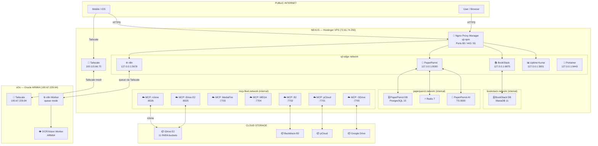
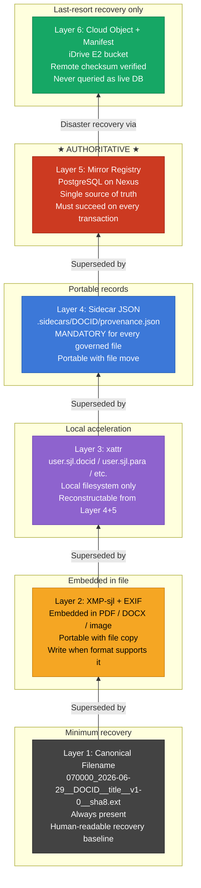
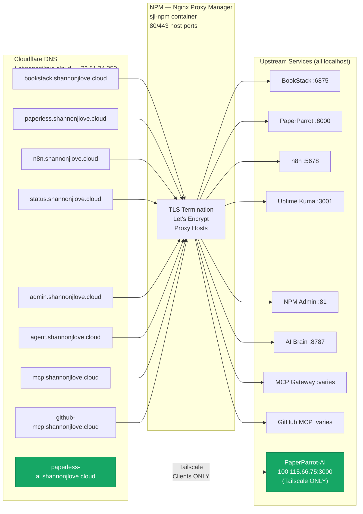
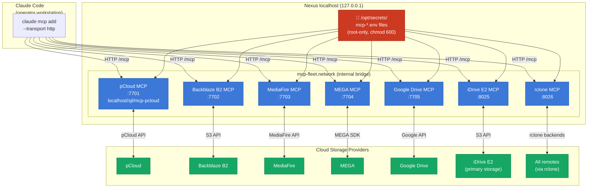
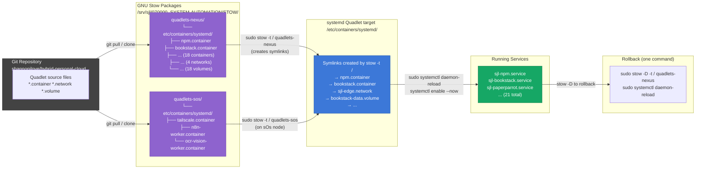
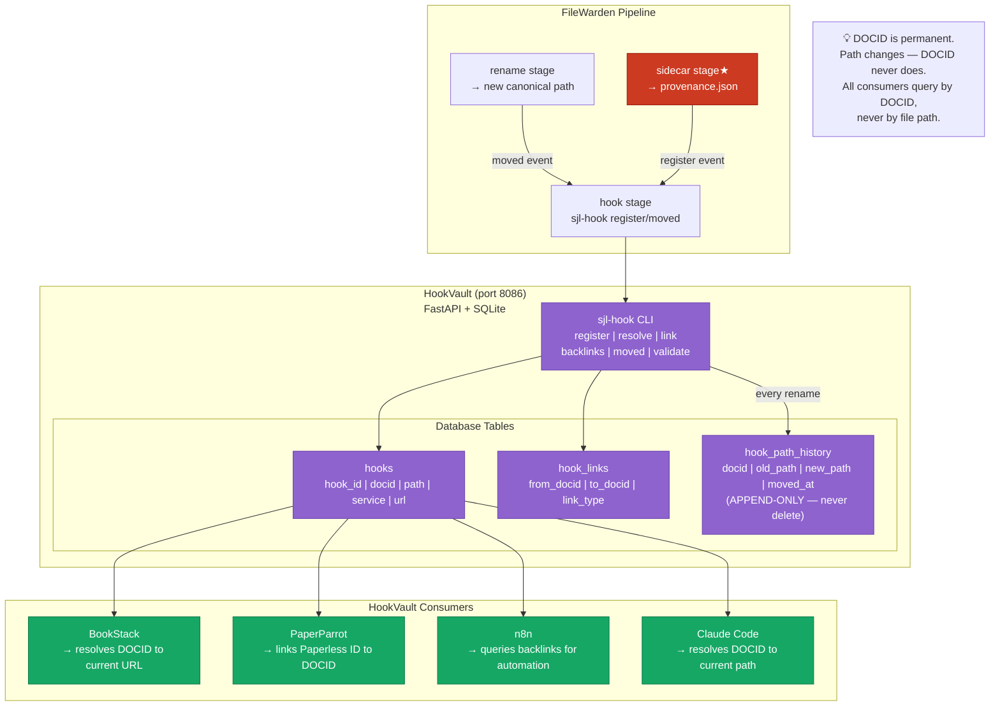
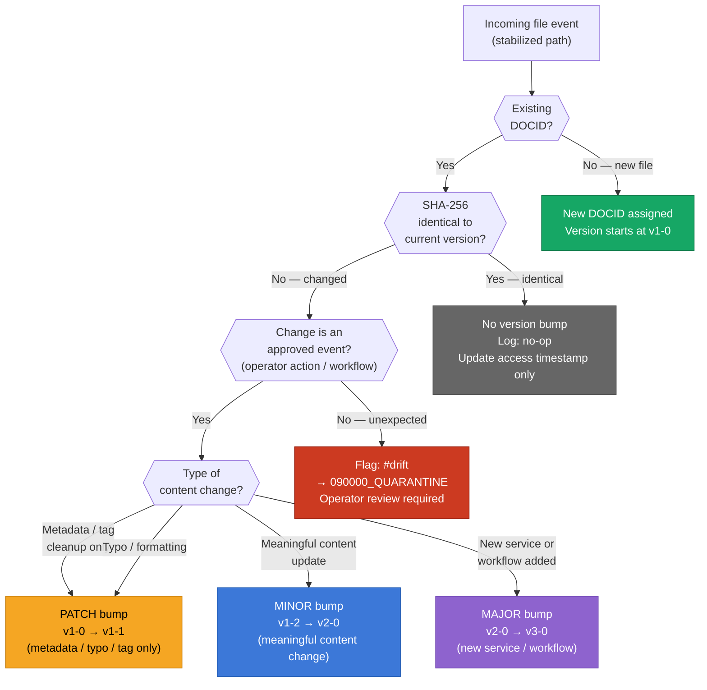
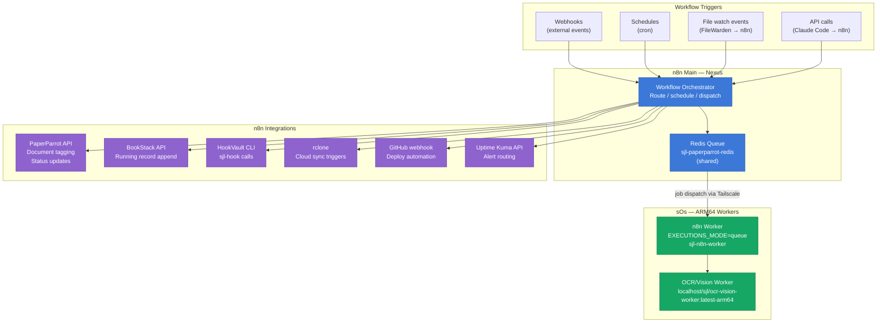
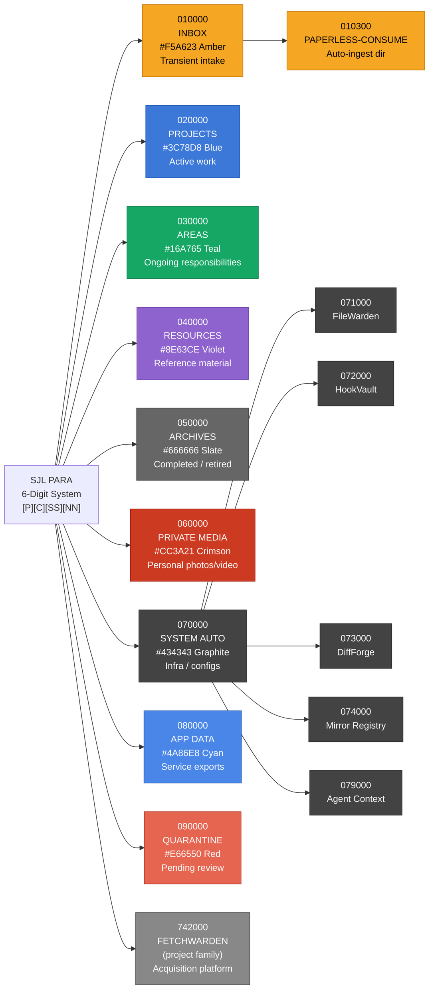

# SJL SOVEREIGN CLOUD — SYSTEM DIAGRAMS
## Mermaid Flowcharts & Architecture v1.0

| Field | Value |
|---|---|
| DOCID | SJL-CLOUD-DIAGRAMS-001 |
| Version | v1-0 |
| Date | 2026-06-29 |
| PARA | 070000_SYSTEM-AUTOMATION |
| Renders in | GitHub, BookStack (Mermaid plugin), Obsidian |

---

## DIAGRAM 1 — Overall System Architecture

---

## DIAGRAM 2 — File Ingest Complete Workflow

```mermaid
flowchart TD
    %% Intake sources
    subgraph SOURCES["FILE INTAKE SOURCES"]
        S1["📱 iOS Share Sheet\n(NeoServer / Files)"]
        S2["💻 macOS Drop\n(sftp / WebDAV)"]
        S3["🌐 n8n Workflow\n(automated)"]
        S4["📧 Email Attach\n(n8n receiver)"]
        S5["🔗 FetchWarden\n(planned — 742000)"]
        S6["⬆️ Direct Upload\n(PaperParrot UI)"]
    end

    subgraph INBOX["010000 INBOX — /srv/sjl/010000_INBOX/"]
        DROP["📥 Drop Zone\n(any subdir)"]
        CONSUME["🗂️ 010300_PAPERLESS-CONSUME\n(PaperParrot auto-consume)"]
    end

    %% FileWarden Pipeline
    subgraph FW["FILEWARDEN v2 DAEMON — 12-Stage Pipeline"]
        FW1["1️⃣ DISCOVER\ninotify / fanotify watch\non approved roots"]
        FW2["2️⃣ STABILIZE\nWait for write quiescence\n(file not changing for 2s)"]
        FW3["3️⃣ IDENTIFY\ncalculate_hash() → SHA256\nassign_docid() → SJL-CLOUD-NNNN"]
        FW4["4️⃣ ANALYZE\nextract_metadata()\nrun_ocr() → text + confidence\nrun_vision() → objects + NSFW score"]
        FW5["5️⃣ VERSION\nsnapshot_previous()\nincrement_version(old_sha, new_sha)"]
        FW6["6️⃣ DIFF\nDiffForge.generate_diff()\n→ .sidecars/DOCID/diffs/"]
        FW7["7️⃣ RENAME\nApply canonical filename:\n[PPPPPP]_YYYY-MM-DD__DOCID__title__vN-N__sha8.ext"]
        FW8["8️⃣ SIDECAR ⚠️ FATAL\nwrite_sidecar(docid, full_record)\n→ .sidecars/DOCID/provenance.json\nXMP-sjl embed + xattr"]
        FW9["9️⃣ HOOK\nHookVault.register(docid, path)\n→ async retry if unreachable"]
        FW10["🔟 MIRROR\nrclone copy → iDrive E2\nVerify remote SHA256 checksum\nMust pass before continuing"]
        FW11["1️⃣1️⃣ REGISTER ⚠️ FATAL\nupdate_registry(docid, transaction)\n→ Mirror Registry (PostgreSQL)"]
        FW12["1️⃣2️⃣ PUBLISH\nBookStack API → append running record\nPaperParrot consume → archive"]
    end

    %% Decision nodes
    HASHFAIL{{"Hash\nfailed?"}}
    NSFW{{"NSFW\n> 0.7?"}}
    CONFIDENCE{{"OCR/vision\nlow confidence?"}}
    COLLISION{{"Filename\ncollision?"}}
    SIDECARFAIL{{"Sidecar\nwrite failed?"}}
    REGFAIL{{"Registry\nwrite failed?"}}
    DRIFTCHECK{{"SHA changed\nwithout approved\nevent?"}}

    %% Terminal states
    QUARANTINE["🔴 090000_QUARANTINE\nAwaiting manual review"]
    INBOX_REVIEW["🟡 010000_INBOX\nLow-confidence review queue"]
    ABORT["❌ TRANSACTION ABORTED\nFile remains at pre-rename path\nError logged to audit trail"]
    STASH["🎬 ServicePrimary = stash\n(private media routing)"]
    COMPLETE["✅ GOVERNED FILE\nIn PARA tree\niDrive E2 mirrored\nMirror Registry registered\nBookStack updated\nPaperParrot archived"]

    %% Intake flow
    S1 & S2 & S3 & S4 & S5 --> DROP
    S6 --> CONSUME
    CONSUME --> PP_DIRECT["PaperParrot processes\ndirectly (OCR + tag)"]

    DROP --> FW1
    FW1 --> FW2
    FW2 --> FW3
    FW3 --> HASHFAIL
    HASHFAIL -->|Yes| QUARANTINE
    HASHFAIL -->|No| FW4

    FW4 --> NSFW
    NSFW -->|Score > 0.7| STASH
    STASH --> FW5
    NSFW -->|Score ≤ 0.7| CONFIDENCE
    CONFIDENCE -->|Low| INBOX_REVIEW
    CONFIDENCE -->|OK| FW5

    FW5 --> DRIFTCHECK
    DRIFTCHECK -->|Drift detected| QUARANTINE
    DRIFTCHECK -->|OK| FW6

    FW6 --> FW7
    FW7 --> COLLISION
    COLLISION -->|Yes| QUARANTINE
    COLLISION -->|No| FW8

    FW8 --> SIDECARFAIL
    SIDECARFAIL -->|Yes - FATAL| ABORT
    SIDECARFAIL -->|No| FW9

    FW9 --> FW10
    FW10 --> FW11
    FW11 --> REGFAIL
    REGFAIL -->|Yes - FATAL| ABORT
    REGFAIL -->|No| FW12

    FW12 --> COMPLETE

    %% Styling
    classDef fatal fill:#cc3a21,color:#fff,stroke:#991a0a
    classDef warn fill:#f5a623,color:#000,stroke:#c47800
    classDef ok fill:#16a765,color:#fff,stroke:#0d7a48
    classDef stage fill:#3c78d8,color:#fff,stroke:#1a56b0
    classDef decision fill:#8e63ce,color:#fff,stroke:#6b3fb0

    class FW8,FW11 fatal
    class QUARANTINE,INBOX_REVIEW,ABORT warn
    class COMPLETE ok
    class FW1,FW2,FW3,FW4,FW5,FW6,FW7,FW9,FW10,FW12 stage
    class HASHFAIL,NSFW,CONFIDENCE,COLLISION,SIDECARFAIL,REGFAIL,DRIFTCHECK decision
```

---

## DIAGRAM 3 — Six-Layer Metadata Authority

---

## DIAGRAM 4 — Subdomain & NPM Routing Map

---

## DIAGRAM 5 — MCP Server Fleet Architecture

---

## DIAGRAM 6 — Quadlet Deployment via GNU Stow

---

## DIAGRAM 7 — HookVault Cross-System Links

---

## DIAGRAM 8 — File Versioning Decision Flow

---

## DIAGRAM 9 — n8n Automation Architecture (Nexus ↔ sOs)

---

## DIAGRAM 10 — PARA Six-Digit Classification Tree

